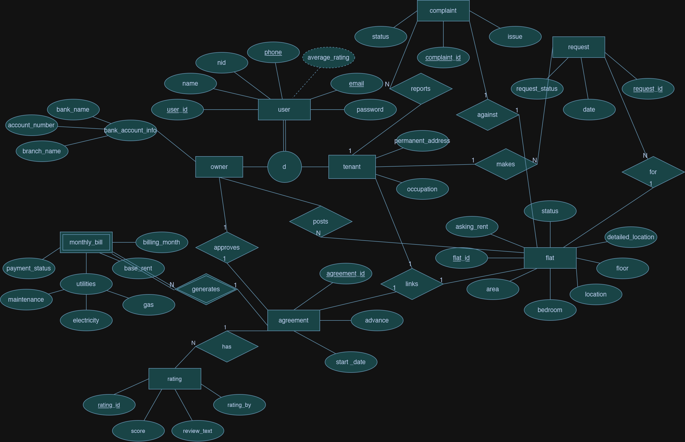
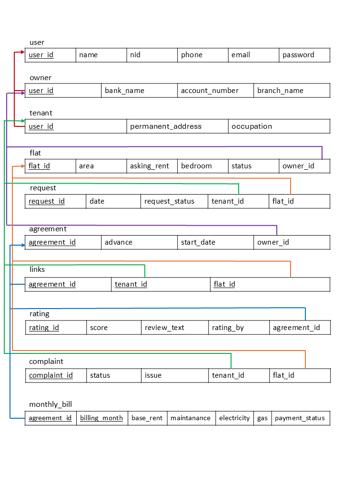

# House Rent Management System

**Course:** CSE-370 (Database Systems) | **Institution:** BRAC University

## 📖 Project Overview

The House Rent Management System is a centralized web application designed to bridge the gap between flat owners and tenants, tailored for local rental structures. It serves a dual purpose: acting as a searchable marketplace for available properties and functioning as a comprehensive management dashboard for active tenancies.

This platform ensures a secure and smooth experience. Owners can list flats, manage monthly billing, and track advance security deposits. Tenants can find their ideal homes using area-based filters, securely view their bill breakdowns, and report complaints. A key feature is the integrated **Mutual Rating System**, where owners and tenants can rate each other, ensuring accountability and transparency in the rental ecosystem.

---

## 👥 Team Members

- **B K M Bodruzzaman** (ID: 23101426) - User Management & Marketplace
- **Rashedul Karim Mahim** (ID: 23301521) - Tenancy Support & Rating System
- **B M Nafizur Rahman** (ID: 23301193) - Core Billing & Agreement Module

---

## 🚀 Key Features

### 👤 Member 1: B K M Bodruzzaman (ID: 23101426)

- **Role-Based Registration & Login:** A secure authentication system routing Owners and Tenants to their respective dedicated dashboards.
- **To-Let Advertisement Posting (Owner):** Form for Owners to list flats with details (area, square feet, rent) with a default 'Available' status.
- **Advanced Search & Filter (Tenant):** Gallery allowing Tenants to filter available flats using SQL `WHERE` and `AND` queries by location, budget, and size.

### 👤 Member 2: Rashedul Karim Mahim (ID: 23301521)

- **Rental Request & Confirmation System:** Tenant expressions of interest; Owner reviews and clicks "Confirm" to officially link the Tenant to the flat and mark the flat as 'Rented'.
- **Maintenance & Issue Reporting:** "Complain Box" for Tenants to report flat issues. Owners track active complaints and mark them as 'Solved' upon resolution.
- **Mutual Rating System:** Tenants can rate owners, and owners can rate tenants based on behavior (1-5 star scale). These averages are displayed on their respective profiles for future reference.

### 👤 Member 3: B M Nafizur Rahman (ID: 23301193)

- **Advance Payment & First Month's Entry:** Once a tenant is confirmed, the Owner formally enters the security deposit (advance) and the first month's initial rent amount into the Agreement.
- **Dynamic Monthly Bill Generation:** Owners input monthly utilities (gas, electricity, water, service charges) which PHP combines with base rent for a total bill.

---

## 📊 Database Schema (EER Diagram)

Below is the Enhanced Entity-Relationship (EER) diagram illustrating the database architecture, including the inheritance (IS-A) relationships for users, the associative agreement linking entities, and the newly integrated Rating system.

---

## 🗄️ Relational Schema

## 

## 🛠️ Technologies Used

- **Frontend:** HTML5, CSS3
- **Backend:** PHP
- **Database:** MySQL
- **Version Control:** Git & GitHub

## ⚙️ Setup Instructions

1. Clone this repository to your local machine (place it in the `htdocs` folder if using XAMPP).
2. Import the database schema located in the `database/` folder (e.g., `house_rent_db.sql`) into your phpMyAdmin.
3. Configure your database connection credentials inside the `config/db_connect.php` file.
4. Launch your local server and access the project via your browser at `localhost/your-repository-name`.
